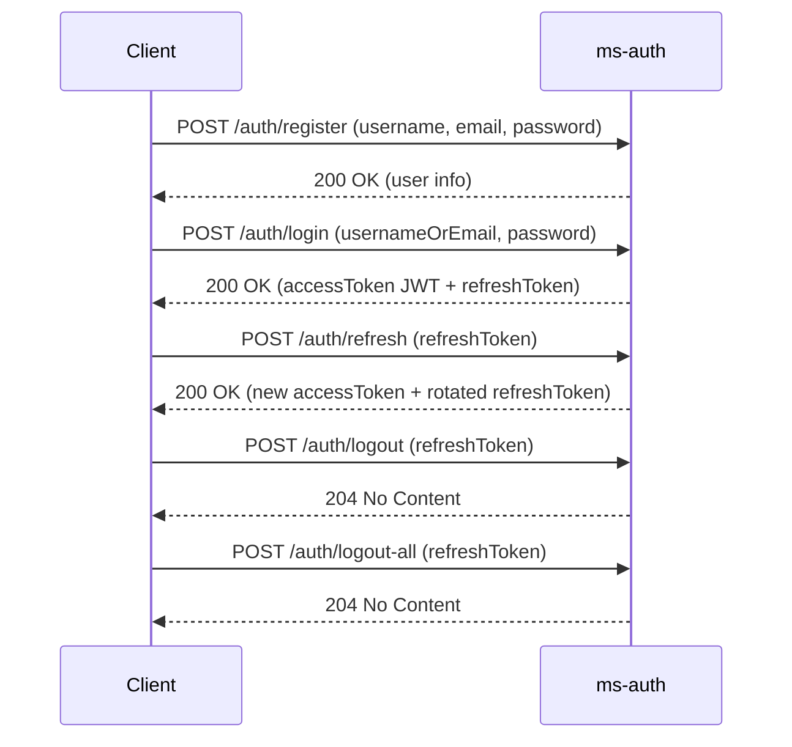

# 🛡️ ms-auth

Microservicio de **autenticación** encargado de:
- Registro de usuarios.
- Inicio de sesión y emisión de **access tokens JWT (RS256)**.
- Gestión y **rotación segura de refresh tokens**.
- Revocación de sesiones (logout individual y global).
- Cambio de contraseña del usuario autenticado.

> Este README cubre **exclusivamente** el servicio `ms-auth` y su comportamiento; es autocontenible para levantarlo, integrarlo y probarlo.

---

## ✨ Características

- **Registro** con validación de campos.
- **Login** con `username` o `email` + password.
- **JWT (RS256)** con `iss`, `aud`, `sub`, `jti`, `iat`, `exp` y claims personalizables (p. ej. `uid`).
- **Refresh tokens opacos** guardados con **hash** (SHA-256 base64url) y **rotación** en `/auth/refresh`.
- **Límite de sesiones** por usuario y **limpieza programada** de refresh tokens caducados.
- **Endpoints idempotentes** para logout.

---

## 🔒 Flujo de seguridad



---

## 🔧 Configuración

`application.yml` (valores de ejemplo):
```yaml
server:
  port: 8081
  address: 0.0.0.0

spring:
  application:
    name: ms-auth
  datasource:
    url: jdbc:postgresql://localhost:5432/authdb
    username: auth_user
    password: secret
    hikari:
      maximum-pool-size: 10
  jpa:
    hibernate:
      ddl-auto: update
    open-in-view: false

management:
  endpoints:
    web:
      exposure:
        include: health,info,metrics

logging:
  level:
    root: INFO
    org.springframework.security: ERROR
    org.hibernate.SQL: ERROR

app:
  jwt:
    issuer: ms-auth
    audience: api
    private-key-location: classpath:jwt/private.pem
    public-key-location: classpath:jwt/public.pem
    expiration-minutes: 60
    refresh-expiration-days: 7
    max-sessions-per-user: 5

security:
  permit-all: /auth/register,/auth/login,/auth/refresh,/auth/logout,/auth/logout-all,/actuator/health,/actuator/info

cors:
  allowed-origins: ""
  allowed-methods: "GET,POST,PUT,DELETE,OPTIONS"
  allowed-headers: "*"
```

### Claves RSA (RS256)
Generación local (ejemplo):
```bash
# Generar privada (PKCS#8)
openssl genpkey -algorithm RSA -pkeyopt rsa_keygen_bits:2048 -out private.pem
# Extraer pública (X.509)
openssl rsa -in private.pem -pubout -out public.pem
```
Ubica `private.pem` y `public.pem` en `src/main/resources/jwt/`.  
**No** subas la clave privada a control de versiones.

---

## 📚 API

### 1) Registro
**POST** `/auth/register`  
Request:
```json
{
  "username": "johndoe",
  "email": "johndoe@example.com",
  "password": "StrongPass123"
}
```
Response 200:
```json
{
  "id": 5,
  "username": "johndoe",
  "email": "johndoe@example.com",
  "enabled": true,
  "createdAt": "2024-01-01T00:00:00Z"
}
```
Validaciones:
- `username`: no vacío, **3–50** chars
- `email`: formato email, **≤120** chars
- `password`: no vacía, **8–128** chars

---

### 2) Login
**POST** `/auth/login`  
Request:
```json
{
  "usernameOrEmail": "johndoe",
  "password": "StrongPass123"
}
```
Response 200:
```json
{
  "tokenType": "Bearer",
  "accessToken": "eyJhbGciOiJSUzI1NiIsInR...",
  "expiresIn": 3600,
  "refreshToken": "A0pYk2...url-safe...",
  "refreshExpiresIn": 604800
}
```
Validaciones:
- `usernameOrEmail`: no vacío
- `password`: no vacía

---

### 3) Refresh
**POST** `/auth/refresh`  
Request:
```json
{
  "refreshToken": "A0pYk2...url-safe..."
}
```
Response 200:
```json
{
  "tokenType": "Bearer",
  "accessToken": "eyJhbGciOiJSUzI1NiIsInR...",
  "expiresIn": 3600,
  "refreshToken": "NnqL5k...url-safe...",
  "refreshExpiresIn": 604800
}
```
Validaciones:
- `refreshToken`: no vacío

---

### 4) Logout (actual)
**POST** `/auth/logout`  
Request:
```json
{
  "refreshToken": "A0pYk2...url-safe..."
}
```
Response: **204 No Content** (idempotente)

---

### 5) Logout (todas las sesiones)
**POST** `/auth/logout-all`  
Request:
```json
{
  "refreshToken": "A0pYk2...url-safe..."
}
```
Response: **204 No Content** (idempotente)

---

### 6) Cambio de contraseña
**PUT** `/users/{id}/password`  
Headers: `Authorization: Bearer <accessToken>`  
Request:
```json
{
  "currentPassword": "OldPass123",
  "newPassword": "NewStrongPass456"
}
```
Response: **204 No Content**  
Notas:
- Solo el **propietario** del recurso puede cambiar su contraseña.
- Validaciones:
    - `currentPassword`: no vacía
    - `newPassword`: no vacía (aplica política de complejidad si se define a nivel de negocio)

---

## 🔍 Esquema de JWT emitido

- **Algoritmo**: `RS256`
- **Claims estándar**:
    - `iss` = `ms-auth`
    - `aud` = `api`
    - `sub` = `username`
    - `jti`, `iat`, `exp`
- **Claims personalizados**:
    - `uid` = id numérico del usuario

---

## 🧰 Swagger / OpenAPI

- **UI**: http://localhost:8081/swagger-ui.html
- **JSON**: http://localhost:8081/v3/api-docs

> Los endpoints abiertos (`/auth/*`, `actuator`) están en **permit-all**; los que modifican recursos del usuario requieren **Bearer JWT**.

---

## ▶️ Puesta en marcha

```bash
# 1) Variables/propiedades listas (DB, claves RSA)
# 2) Compilar y levantar
mvn spring-boot:run
```

Salud de servicio:
- **/actuator/health** → OK/UP
- **/actuator/info** → metadata

---

## 🧪 Tests

- Tests de API y flujo de tokens (login, refresh, límites de sesión).
- Limpieza programada de refresh tokens (scheduler) y validaciones de seguridad.

Ejecutar:
```bash
mvn test
```

---

## 🧱 Tecnologías

- Java 17, Spring Boot 3.x
- Spring Web / Validation / Data JPA (PostgreSQL + HikariCP)
- JSON Web Tokens (JJWT 0.11.x)
- OpenAPI/Swagger (springdoc)

---

## ✅ Buenas prácticas

- Mantener **HTTPS** en entornos no locales.
- No versionar la **clave privada**.
- Rotar claves RSA de forma periódica.
- Usar **`audience`** coherente con los consumidores.
- Establecer políticas de expiración **cortas** para access tokens y **rotación** estricta de refresh.

---
