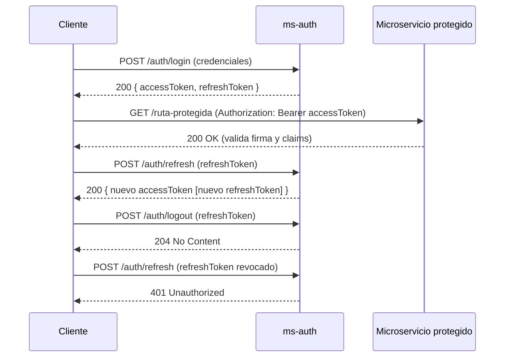

# 🔐 SECURITY.md — ms-auth

Este documento describe en detalle la **arquitectura de seguridad** implementada en `ms-auth`,  
incluyendo el manejo de **JWT RS256**, **refresh tokens** y la integración segura con otros microservicios  
mediante el módulo [`shared.security`](../shared.security).

---

## 🎯 Objetivos de seguridad

- **Emitir tokens seguros** firmados con clave privada RSA.
- **Validación distribuida** en otros microservicios usando solo la clave pública.
- **Rotación segura** de refresh tokens.
- **Revocación** individual y global de sesiones.
- **Protección por defecto** de todos los endpoints, salvo los listados en `permit-all`.

---

## 🔑 Tipos de credenciales

### 1. Access Token (JWT RS256)
- **Firmado** con clave privada (`private.pem`), verificado con la clave pública (`public.pem`).
- **Duración corta** (`app.jwt.expiration-minutes`).
- **Claims estándar**:
    - `sub` → nombre de usuario
    - `uid` → ID del usuario
    - `iss` → `ms-auth`
    - `aud` → `api`
    - `iat`, `exp`, `jti`
- **Claims opcionales**: `roles`, `permissions`.
- **Uso**: Enviar como `Authorization: Bearer <token>`.

### 2. Refresh Token
- **No es JWT** (opaco, aleatorio, seguro).
- **Solo se almacena el hash** (SHA-256 base64url).
- **Duración larga** (`app.jwt.refresh-expiration-days`).
- **Revocable** mediante `/auth/logout` o `/auth/logout-all`.
- **Rotación** opcional en `/auth/refresh`.

---

## 🔄 Flujo de autenticación y autorización

